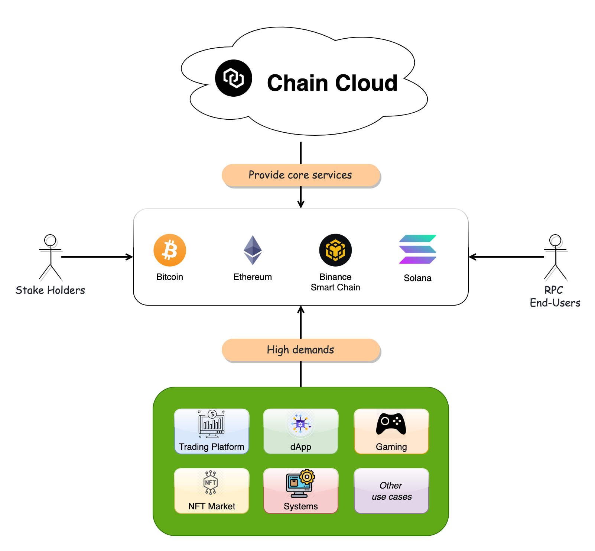

# Introduction

Chain Cloud is a decentralized and distributed infrastructure designed for developers to access blockchain networks on-demand, and for providers to invest in the full nodes RPC demands around the world. In addition, clients can utilize various services within Chain Cloud to meet their blockchain and web3 product needs.&#x20;

<!-- Changed by Ozren -->
<!-- 1. [Standard API](./rpc-services/standard-api.md): Free and instant access to our range of Public RPC APIs.
2. [Premium API](./rpc-services/premium-api/premium-api.md): Sign up to our Premium Plan with a minimum deposit of 0.01 XCN and get access to powerful features. -->
<!--  -->
1. [Node Services](./node-services/node-services.md): Full, Archive nodes are available for 18 chains.
    1. Arbitrum
    2. Astar
    3. Aurora
    4. Avalanche
    5. Bitcoin
    6. Bittorrent
    7. BSC
    8. Celo
    9. Cronos
    10. Ethereum
    11. Ethereum Classic
    12. Fantom
    13. Gnosis
    14. Huobi
    15. Klaytn
    16. Optimism
    17. Polygon
    18. Solana

## Overview

Chain Cloud Services is the gateway through which Web3 developers, projects, and protocols connect to the node infrastructure and development tools they need to build Web3 applications.

<!-- Changed by Ozren -->
<!-- We provide free, public RPC endpoints for developers, alongside Premium and Enterprise plans packed with advanced developer tools — all powered by a globally distributed and decentralized network of nodes. In the Chain Cloud Premium API, developers paid for access to on-chain data, independent node providers serve blockchain requests to earn XCN tokens. -->

<!-- Standard API are available to all and free to use on the Chain Cloud platform. Today, blockchain developers and projects can use these RPC endpoints to access Bitcoin, Ethereum, BSC and Solana with no need to input user info or login credentials. -->
<!--  -->

To access all the advanced features of Chain Cloud RPC, developers can use Premium APIs. Premium features include exclusive multi-chain RPC endpoints, prioritized requests, WebSockets to make Web3 development an easy task.

## For developers:

* **Use the unlimited request RPC**
  * As the blockchains world is growing constantly, the demands for RPCs is higher. With Chain Cloud, the developers can access to that kind of RPC for multiple chains with unlimited requests from multi regions.
* **Security**
  * Chain Cloud provide security for developers, including API Key, Whitelist for domains and IP Addresses.

<!-- ## For node providers:

* **Earn XCN for enabling Web3 development**
  * Node providers will stake XCN to provide nodes, at the same time earn the XCNs for serving the Web3 developers and applications&#x20;
* **Boost Web3 integration and adoption**
  * Become part of a Network that provides developers faster and more reliable connections to blockchains so their decentralized applications can work more efficiently.
* **Own & govern a foundational layer of Web3**
  * Those who stake XCN can participate in the XCN DAO to make critical decisions affecting the Network's future. -->