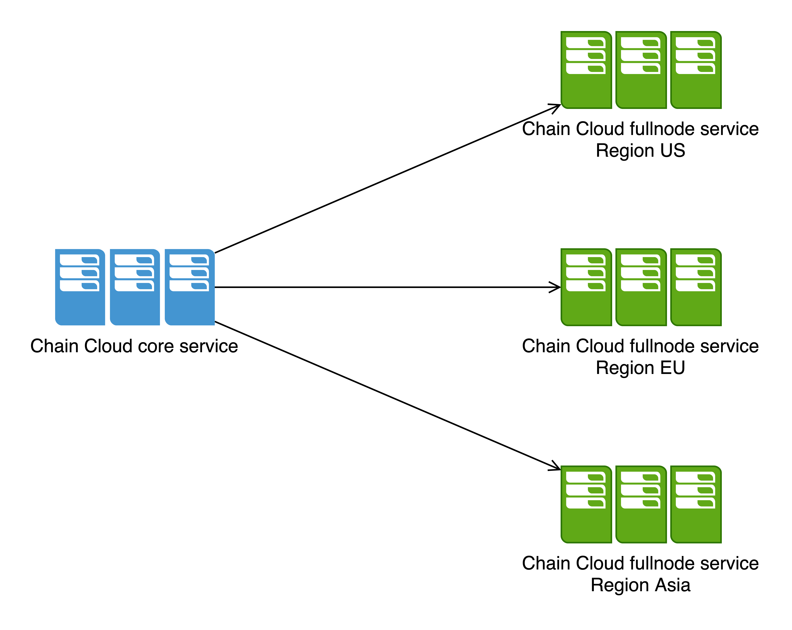
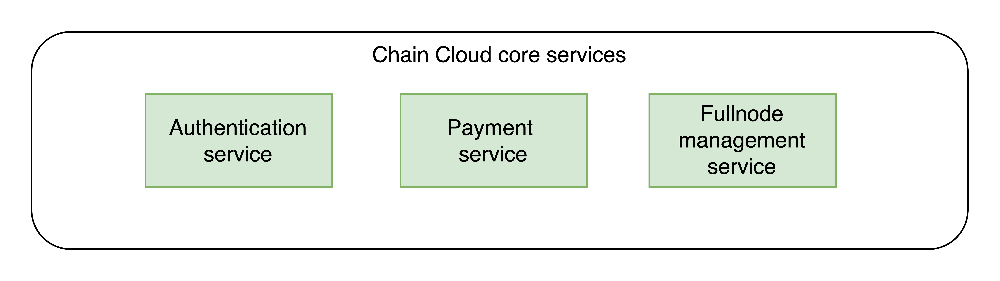
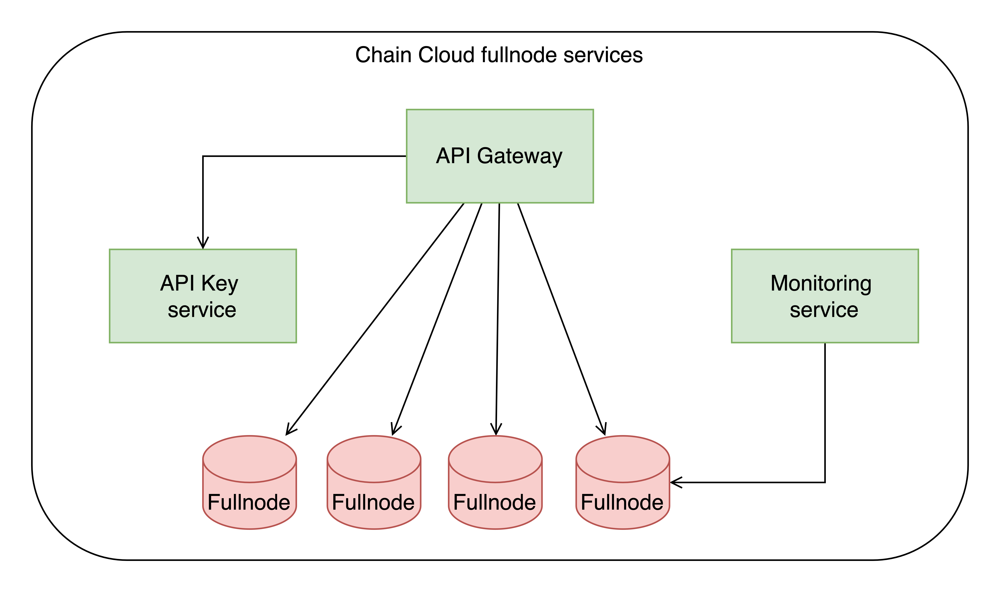

# Architecture

Chain Cloud Node services will have 2 parts:

* Chain Cloud Core Service: Provided by Chain Cloud, which helps process the requirements of creating full nodes, payments.
* Chain Cloud Full-node Service: Handle the requests load balancing from users. This service is based in multiple regions, currently 3 main regions: US, EU and Asia, which helps the users connect to the system smoothly.

* Chain Cloud Core Services: Provide services such as payments and management for end-users. Through these services, the end-users can purchase Premium API keys and manage their API keys. For providers, core services will provide the way for them to make payment and manage their own fullnodes they provided. Finally, these services help enterprise users to pay and tracking dedicated fullnoded created.

* Chain Cloud Fullnode Service: The Kubernates multi-region clusters system helps user to connect to the Blockchain RPCs from anywhere over the world. It has 3 main components:
  * API Gateway: Using Java Spring Cloud as a solution to balance the RPC requests. With Java, we can have an API Gateway with high availability and stable.
  * API Key service: Design with Golang, this service can handle a large amount of request, up to billions.
  * Monitoring: Using to tracking the fullnode deployed, ensure the fullnode is healthy for the API Gateway demands.

