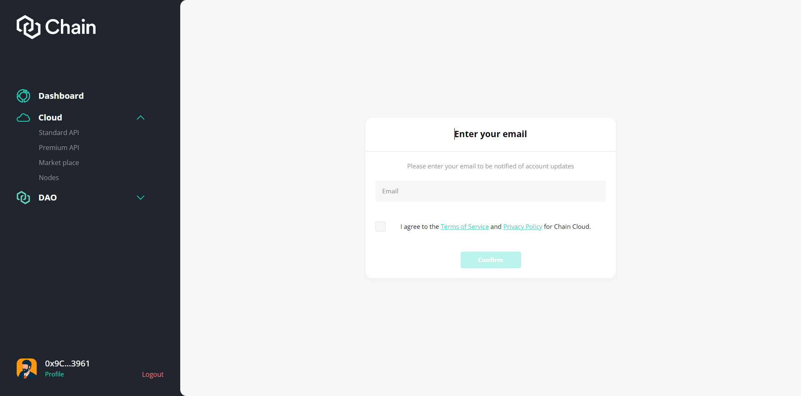
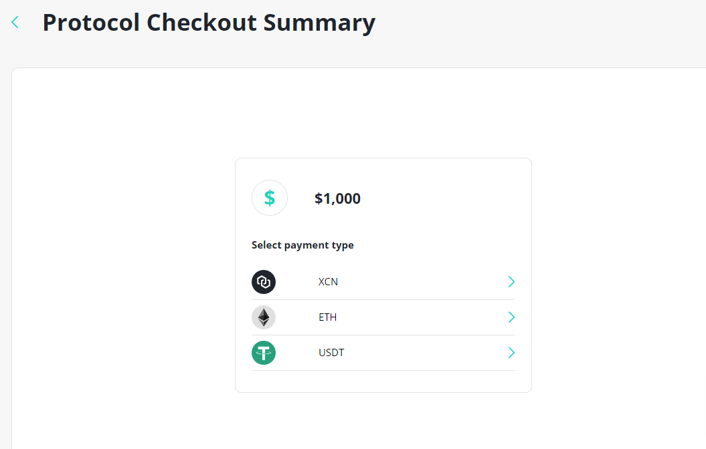

# Enterprise Node

To start deploying nodes, there are some required steps for you to go through:

`Connect Wallet` --> `Add Email` --> `Go to the Marketplace` --> `Make Basic Configuration for the Node` --> `Make payment` --> `Deploy Node`

* **Connect a wallet**: first things first, connecting your MetaMask wallet (Or other wallets that supported) is the key to access your account and start using Premium services.
* **Add Email:** This step is mandatory. It will be used as way to receive notification in the future.
* **Go to Marketplace:** As you added the email, you are now eligible to deploy node. You will have to choose which chains you will deploy the node.
* **Make Basic Configuration**: You will have to choose which node plan is suited for you. There are 2 node plans:
  * Protocol Node: You will have to stake XCN and make payment to deploy this kind of node. You can earn rewards in XCN for deploying this type of node.
  * Enterprise Node: This is the plan for enterprise. You don't have to stake XCN to deploy this node and you won't receive reward for deployment. However, you can use this node privately.
* **Stake XCN (Protocol Nodes):** You will have to stake XCN to deploy a Protocol Node.
* **Make Payment:** You will make payment for the node when you deploy it and each 30 days. You can use USDC, XCN, ETH.
* **Deploy Node:** After you finished paying and staking (if you deploy a protocol node) --> The node will be automatically deployed. However there will be sometimes for the node to synch.

### **Connect Wallet**

The wallet connection procedure is the following:

1. Go to Chain Cloud dApp.
2. Connect Wallet using Metamask, WalletConnect or Coinbase Wallet.

### **Add Email**

As you connected to the dApp, you will be asked to provide the email address. Please provide your email address as this is mandatory.

### Go to marketplace

On the left menu, under Cloud category, user click "Marketplace" to start choosing which chain you want to deploy the node to.

### Make Basic Configuration

After you choose which chain you want to deploy the node to, you will have to choose which plan is suitable for you. There are 2 types of node:

* Protocol Node: You will have to stake XCN and make payment to deploy this kind of node. You can earn rewards in XCN for deploying this type of node.
* Enterprise Node: This is the plan for enterprise. You don't have to stake XCN to deploy this node and you won't receive reward for deployment. However, you can use this node privately.

Depend on which plan you choose, your next step will be staking XCN or Make payment.


Also, as a Enterprise node user, you will have to choose a subdomain for the node. You can connect to this node by websocket or a normal API address. It work just like an Premium API plan, but you will have access to this node privately.&#x20;


### Make Payment 

You can pay using USDC, ETH or XCN.

### Deploy Node

After you have finished payment, the node will need time to finish synching. This process will be automatic and work as following:

1. Start backend process
2. Show pending screen for the user and to visit back in 24 hours.
3. Once backend CRON is done and deployed. Change user status for this nodeUID to success and update user front end status
4. User 30 day lock on stakes amount begins

:::info
If there is some error during the deployment, please contact admin for support.
:::

### Acquire Endpoint URL

After the node is deployed successfully, the user can use the custom endpoint URL for the enterprise node by going to the node detail page.

Under the Connect tab, the user can use the Endpoint URL under Links section (image below)

### Renew Node

Under the Configure tab, the user can renew the node by clicking Renew. This will move the user to the page to choose which way of payment the user want to use (image below).

:::caution
The node will be automatically terminated if the user is late to renew the node for 7 days.
:::

### Cancel Node

At the same Configure tab, the user can cancel their own node by clicking "Cancel Node". The node will be terminated after the node expired time.

:::caution
This step can not be reverted so please make sure if you want to cancel the node.
:::