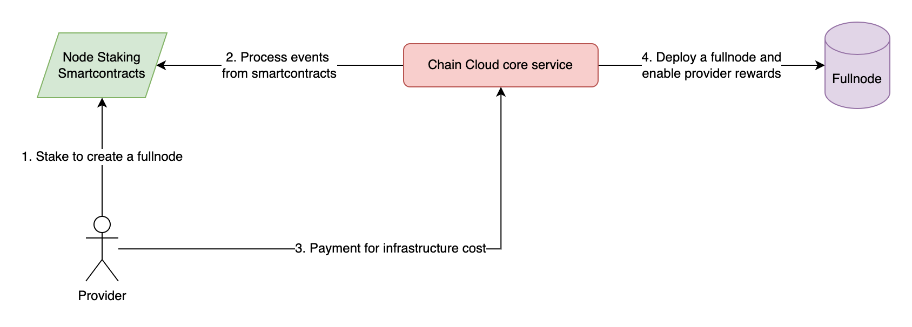

# Payment methods

<!-- Changed by Ozren -->
<!-- Chain Cloud provides 2 RPC services: -->
<!-- 
* Standard API: Free and instant access to our range of Standard APIs. [_Read more_](../rpc-services/standard-api.md)
* Premium API: Sign up to our Premium Plan with a minimum deposit of 100,000 XCN/month and get access to powerful features. [_Read more_](../rpc-services/premium-api/premium-api.md) -->

For Premium API, you will need to pay using XCN, which is a cryptocurrency. We are using a Payment contract for the user to pay on-chain.&#x20;

