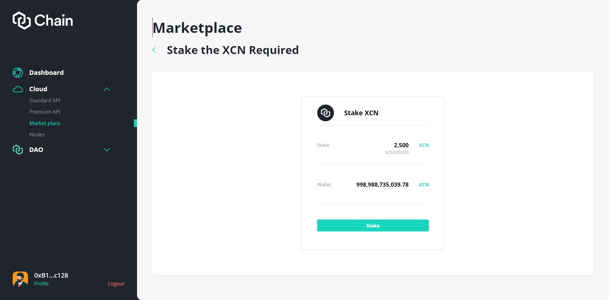
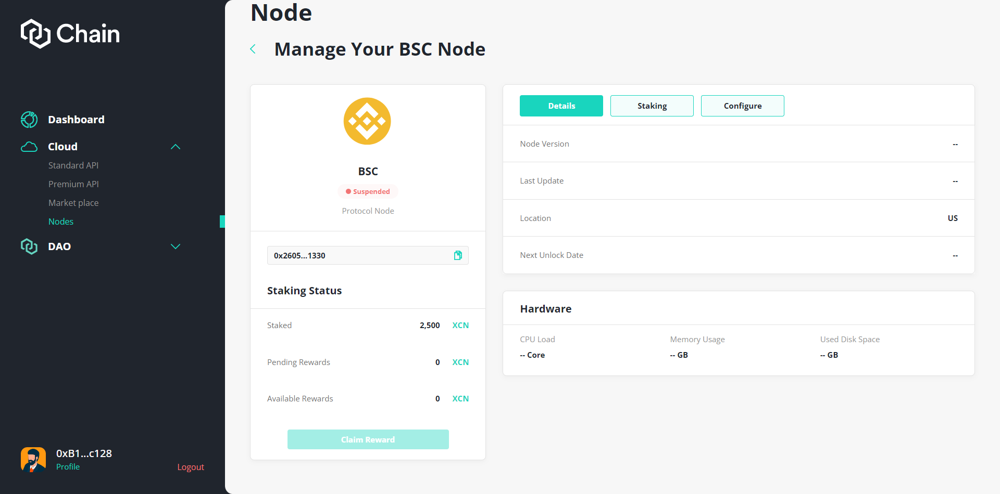

# Node Staking

### Purchase XCN

Visit any DEX to swap for the desired amount of XCN

### Stake XCN

:::tip
Make sure you have some ETH to pay the gas fee for your staking transaction.

Currently, **XCN can only be staked on Ethereum**.

You can claim your rewards after the locking period of 30 days. This period applies to each staking transaction independently. However, your stake will keep generating rewards until you unstake.
:::

:::caution
You have to stake every time you deploy a protocol node. If you unstake, the node will be terminated immediately.&#x20;
:::

### Claim Rewards

After node is launched successfully, the reward will be generated. When the rewards is calculated --> the users can claim them by clicking "Claim Rewards"

:::info
The reward will be generated during Lock Up term. These reward amount will be pending until Withdraw term. After the end of lock up term, the pending reward will be available to claim.&#x20;

The reward being calculated during withdraw term will be pending til the next withdraw term.
:::

###