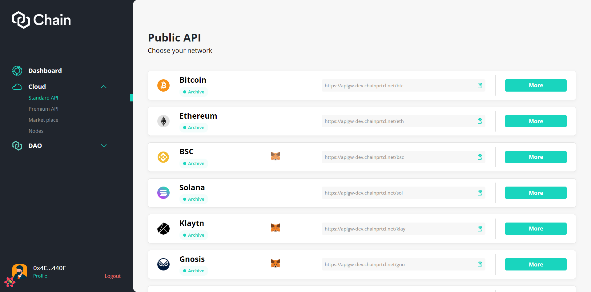

# Standard API

_Standard API_ is central to the Chain Cloud vision of mass adoption in Web 3.0 and the crypto economy. Chain Cloud's Standard API provides you with API endpoints for a fast and reliable access to a growing number of networks:

### Make requests via public URL (no sign up or KYC) <a href="#make-requests-via-public-url-no-sign-up-or-kyc" id="make-requests-via-public-url-no-sign-up-or-kyc"></a>

:::tip
Try copying this code into your command line/terminal.

```html
curl https://api-us.chainprtcl.net/btc \
 -X POST \
 -H "Content-Type: application/json" \
 --data '{"jsonrpc":"2.0","method":"web3_clientVersion","params":[],"id":1}'
```
:::

Enjoy the following benefits:

* Permission-less, Open access to 18 chains (more to come)
* Zero cost access to Public RPC endpoints
* No username or password required
* Dashboard views of the status of individual chain public RPCs

### How to use

As the user, first you have to connect to the dApp using Metamask, WalletConnect or CoinBase Wallet.


After that, choose Standard API on the left menu (Under Cloud category)



User can check the dashboard views of the status of individual chain public RPCs by click "More"&#x20;
