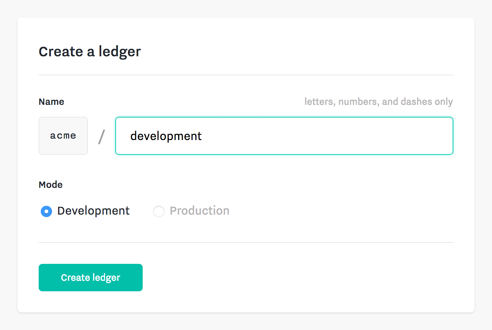
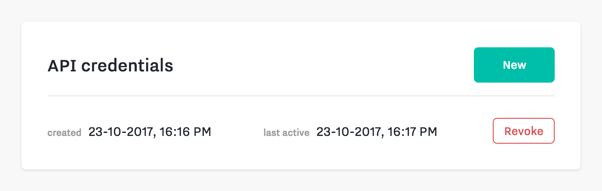

import Tabs from '@theme/Tabs';
import TabItem from '@theme/TabItem';

This guide will teach you the basics of interacting with a ledger from an SDK.

### Setup
First, you'll need to create a ledger and API credentials.

#### Create a ledger
To create a ledger, visit your team dashboard and select the "Ledgers" tab in the team navigation bar and click the "New" button.

You will be asked to choose a name composed of letters, numbers and hyphens. The name must be unique within your team. Let's name this ledger `test`.



#### Create API Credentials

To access your ledger from an SDK, you'll need an API credential.
For development, it's convenient to use a Personal API credential.

You can create a Personal API Credential in your team dashboard:

1. Click the user account menu in the top right of the navigation bar
2. Select "Account"
3. Scroll down to the "API credentials" section
4. Click the "New" button.



For security, you will only be able to view your new API Credential once, so make sure to copy it for use in your SDK.


### Instantiate SDK client

To instantiate the SDK client, specify a **ledger name** and a **credential**.
Let's specify the `test` ledger and the credential we just created.

<Tabs>
<TabItem value='java' label='Java'>

```java
Client ledger = new Client.Bu   ilder()
  .setLedgerName("test")
  .setCredential(System.getenv("SEQCRED"))
  .build();
```

</TabItem>
<TabItem value='node' label='Node.js'>

```js
const ledger = new sequence.Client({
  ledgerName: 'test',
  credential: process.env.SEQCRED,
})
```

</TabItem>
<TabItem value='ruby' label='Ruby'>

```ruby
ledger = Sequence::Client.new(
  ledger_name: 'test',
  credential: ENV['SEQCRED'],
)
```

</TabItem>
</Tabs>

### Create a key

Transactions in the ledger are authenticated by cryptographic keys.

To create a key, provide an **id** (a unique identifier).
If no id is provided, one will be automatically generated.

<Tabs>
<TabItem value='java' label='Java'>

```java
new Key.Builder().setId("key").create(ledger);
```

</TabItem>
<TabItem value='node' label='Node.js'>

```js
await ledger.keys.create({ id: 'key' })
```

</TabItem>
<TabItem value='ruby' label='Ruby'>

```ruby
ledger.keys.create(id: 'key')
```

</TabItem>
</Tabs>

### Create a flavor

For each type of token you want to track in a ledger, you first create a flavor. You can then issue tokens of that flavor into an account.

To create a flavor, provide an **id** (a unique identifier) and one or more **keys**.

<Tabs>
<TabItem value='java' label='Java'>

```java
new Flavor.Builder()
  .setId("usd")
  .addKeyId("key")
  .create(ledger);

```

</TabItem>
<TabItem value='node' label='Node.js'>

```js
await ledger.flavors.create({
  id: 'usd',
  keyIds: ['key']
})
```

</TabItem>
<TabItem value='ruby' label='Ruby'>

```ruby
ledger.flavors.create(id: 'usd', key_ids: ['key'])
```

</TabItem>
</Tabs>

### Create accounts

Accounts represent entities in the ledger and can each hold many different flavors of tokens.

To create each account, provide an **id** (a unique identifier) and one or more
**keys**.

<Tabs>
<TabItem value='java' label='Java'>


```java
new Account.Builder()
  .setId("alice")
  .addKeyId("key")
  .create(ledger);
new Account.Builder()
  .setId("bob")
  .addKeyId("key")
  .create(ledger);

```

</TabItem>
<TabItem value='node' label='Node.js'>

```js
await ledger.accounts.create({
  id: 'alice',
  keyIds: ['key']
})
await ledger.accounts.create({
  id: 'bob',
  keyIds: ['key']
})
```

</TabItem>
<TabItem value='ruby' label='Ruby'>

```ruby
ledger.accounts.create(id: 'alice', key_ids: ['key'])
ledger.accounts.create(id: 'bob', key_ids: ['key'])
```

</TabItem>
</Tabs>

### Issue tokens

To issue tokens, use the **issue** action in the transaction builder
and provide a **flavor**, an **amount**, and a **destination account**.

The `transact` method automatically applies any necessary key signatures and
submits the transaction to the ledger.

<Tabs>
<TabItem value='java' label='Java'>

```java
new Transaction.Builder()
  .addAction(
    new Transaction.Builder.Action.Issue()
      .setFlavorId("usd")
      .setAmount(100)
      .setDestinationAccountId("alice")
  ).transact(ledger);
```

</TabItem>
<TabItem value='node' label='Node.js'>

```js
await ledger.transactions.transact(builder => {
  builder.issue({
    flavorId: 'usd',
    amount: 100,
    destinationAccountId: 'alice',
  })
})
```

</TabItem>
<TabItem value='ruby' label='Ruby'>

```ruby
ledger.transactions.transact do |builder|
  builder.issue(
    flavor_id: 'usd',
    amount: 100,
    destination_account_id: 'alice',
  )
end
```

</TabItem>
</Tabs>

### Transfer tokens

To transfer tokens, use the **transfer** action in the
transaction builder and provide a **flavor**, an **amount**,
a **source account**, and a **destination account**.


<Tabs>
<TabItem value='java' label='Java'>

```java
new Transaction.Builder()
  .addAction(
    new Transaction.Builder.Action.Transfer()
      .setFlavorId("usd")
      .setAmount(50)
      .setSourceAccountId("alice")
      .setDestinationAccountId("bob")
  ).transact(ledger);
```

</TabItem>
<TabItem value='node' label='Node.js'>

```js
await ledger.transactions.transact(builder => {
  builder.transfer({
    flavorId: 'usd',
    amount: 50,
    sourceAccountId: 'alice',
    destinationAccountId: 'bob',
  })
})
```

</TabItem>
<TabItem value='ruby' label='Ruby'>

```ruby
ledger.transactions.transact do |builder|
  builder.transfer(
    flavor_id: 'usd',
    amount: 50,
    source_account_id: 'alice',
    destination_account_id: 'bob',
  )
end
```

</TabItem>
</Tabs>

### Retire tokens

To retire tokens, use the **retire** action in the transaction builder
and provide a **flavor**, an **amount**, and a **source account**.

<Tabs>
<TabItem value='java' label='Java'>

```java
new Transaction.Builder()
  .addAction(
    new Transaction.Builder.Action.Retire()
      .setFlavorId("usd")
      .setAmount(10)
      .setSourceAccountId("bob")
  ).transact(ledger);
```

</TabItem>
<TabItem value='node' label='Node.js'>

```js
await ledger.transactions.transact(builder => {
  builder.retire({
    flavorId: 'usd',
    amount: 10,
    sourceAccountId: 'bob',
  })
})
```

</TabItem>
<TabItem value='ruby' label='Ruby'>

```ruby
ledger.transactions.transact do |builder|
  builder.retire(
    flavor_id: 'usd',
    amount: 10,
    source_account_id: 'bob',
  )
end
```

</TabItem>
</Tabs>
