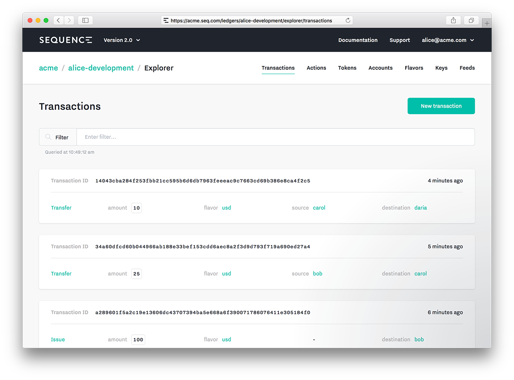

The Ledger Explorer is a tool designed for developers and product managers. It enables both read and write access to the ledger (dependent on a person's role) through a convenient web interface.

The explorer is helpful for prototyping you model, setting up your ledger, and debugging your application.

### Prototyping
As you are designing your ledger model, you can prototype all the interactions in the explorer without writing any code.

For example, you may wish to experiment with different asset tag configurations and the balance queries you can perform as a result. This is all easy to do in the explorer.

### Setup
The explorer is a great place to setup your application by performing operations that only need to occur once.

For example, if your application needs a fixed number of assets or accounts, you can create them in the explorer without writing any code.

### Developing
As you're developing your application, the explorer is a quick place to execute manual operations for sections of code that you haven't written yet.

For example, you may wish to simulate some new types of transactions as you are working on the UI that displays them. This is easy to do with the transaction builder form.

