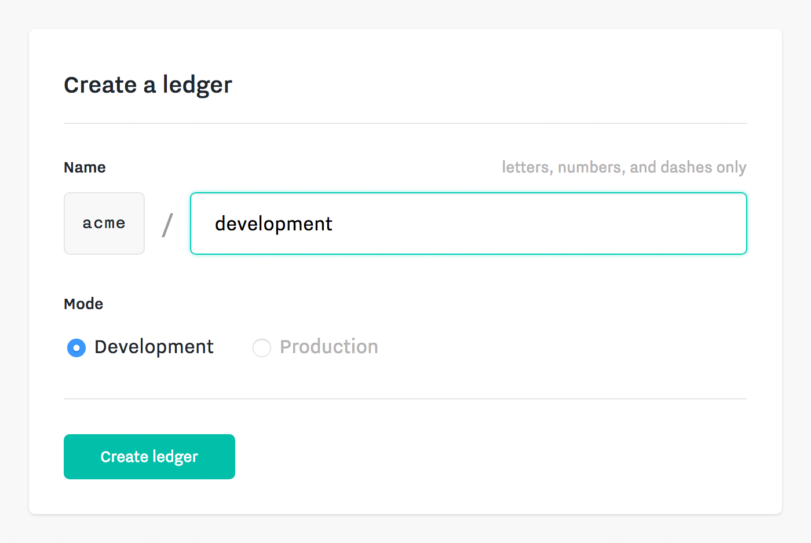

Each ledger in your team is a discrete, append-only, cryptographically linked system of record.

You will likely create many ledgers to support your development process. For example, you may have the following ledgers in your team:

* Production &mdash; `prod`
* Staging &mdash; `staging`
* Alice's development ledger &mdash; `alice-dev`
* Bob's development ledger &mdash; `bob-dev`

### Create a ledger
To create a ledger, visit your team dashboard and select the "Ledgers" tab in the team navigation bar and click the "New" button.

You will be asked to choose a name composed of letters, numbers and hyphens. The name must be unique within your team.

#### Ledger Mode
A ledger can be created in one of two modes: **development** or **production**.

Development ledgers are used for prototyping and testing. You can create as many development ledgers as you need (e.g. one per developer on your team) and easily reset or delete them.

Production ledgers are used for applications in production that are recording actual transactions and balances. You will typically have only one production ledger. *For safety, ledgers in production mode cannot be renamed, reset, or deleted.*

While it is not possible to change the mode of a ledger, the interfaces for development and production ledgers are identical. This means that you can easily move an application built on a development ledger into production. You simply setup a new production ledger which your application can point to. No code changes are required.

### Reset a ledger

Since a ledger is append-only, you cannot edit transactions once they have been created. However, during development, you can easily reset all data in a ledger by visiting the team dashboard or using the SDK.

To reset a ledger in development mode via the team dashboard:

1. Select the "Ledgers" tab in the team navigation bar
2. Click the ledger you want to reset to view the ledger page
3. Select the "Settings" tab in the ledger navigation bar
4. Scroll down to the "Reset Ledger" section

**Resetting will delete all keys, flavors, accounts, transactions, actions, tokens, and feeds in the ledger.**