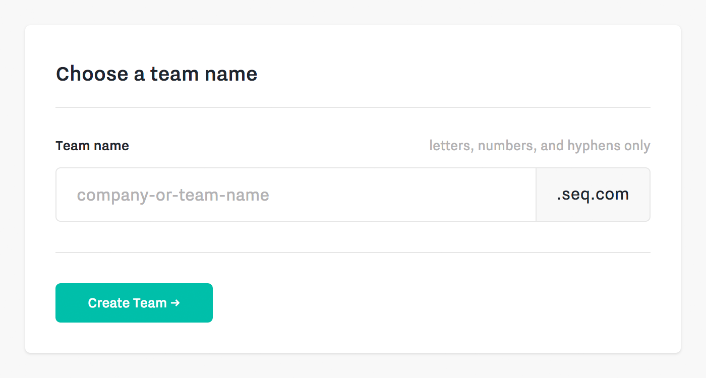
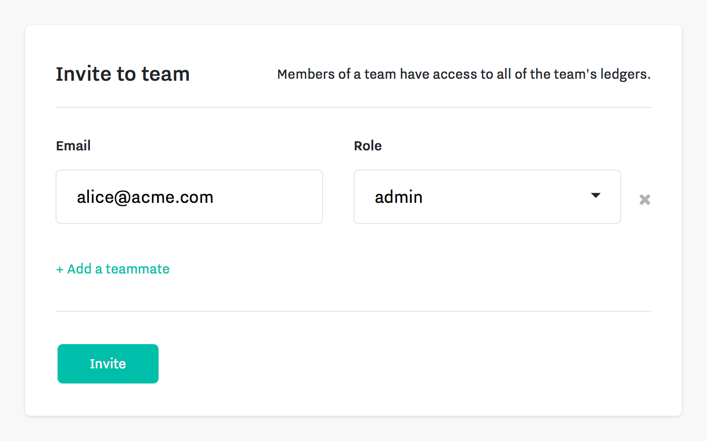

A team contains **[ledgers](ledgers.md)** that can be accessed by **[people](access-control.md#people)** and **[systems](access-control.md#systems)** based on their assigned **[roles](access-control.md#roles)**.

### Create a team

When you **[create a team](https://sequence.chain.com/start)**, you will be asked to enter a **team name**, which will be used to generate your **team URL**. This is where all people on your team will log in to the team dashboard.

### Invite people

After creating your team, you will be prompted to invite people and assign a [role](access-control.md#roles) to each.

Each person you invite will receive an email with instructions to create an account within your team.